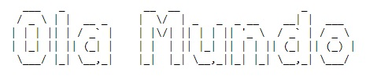

# Python-ASCII-Art-Generator

Gerando arte com ASCII a partir de textos e imagens com Python.

A arte ASCII também é conhecida como "arte de texto de computador". Envolve o posicionamento inteligente de letras ou caracteres especiais digitados para criar uma forma visual que se espalhe por várias linhas de texto.

[Acesso o tutorial](https://github.com/lisaterumi/Python-ASCII-Art-Generator/blob/main/Python%20ASCII%20Art%20Generator.ipynb).
